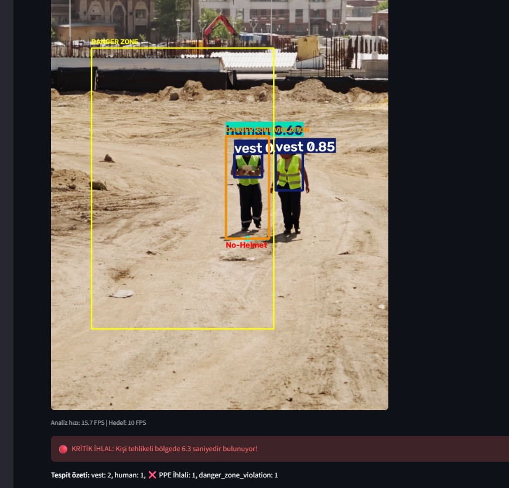
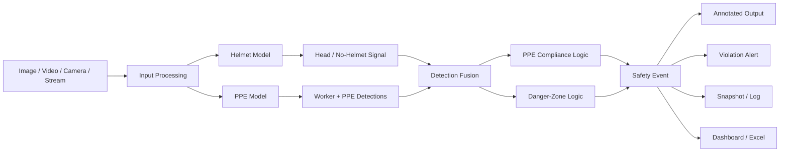
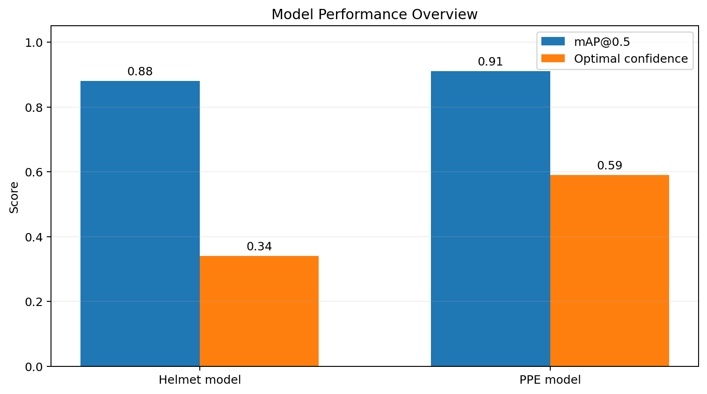
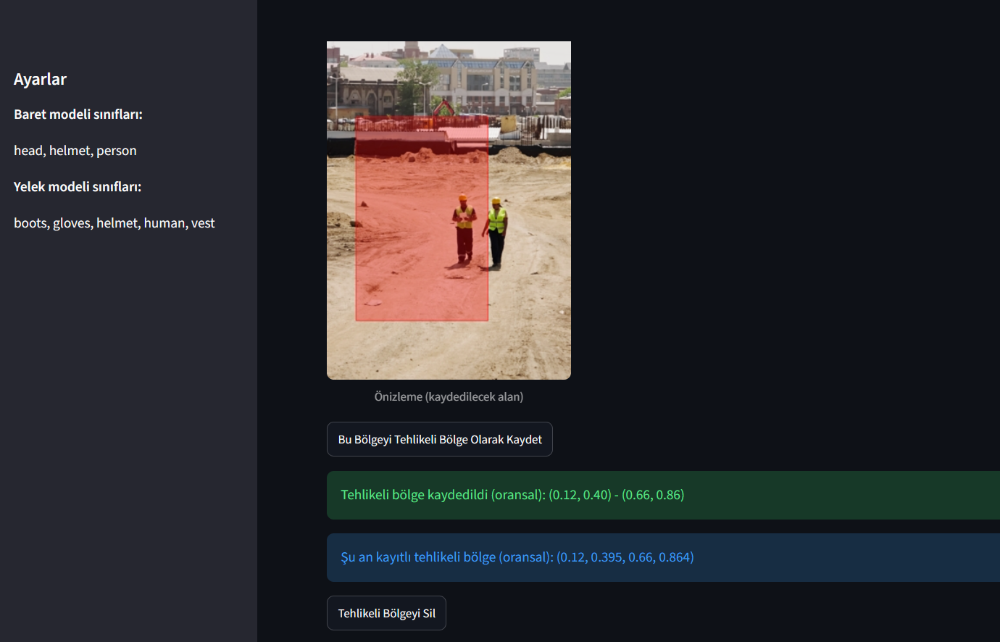
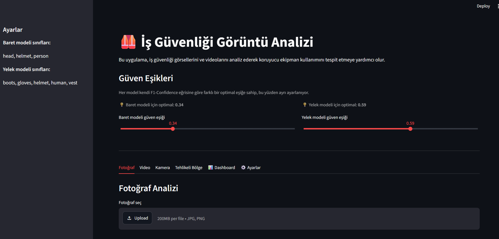

# 🦺 PPE Safety Detection

<p align="center">
  <strong>Computer vision-based workplace safety monitoring with PPE compliance and danger-zone analysis.</strong>
</p>

<p align="center">
  
  
  
  
  
</p>

## 🔎 Overview

**PPE Safety Detection** is a computer vision application for analyzing workplace images, videos, cameras, and online streams for personal protective equipment compliance and hazardous-area violations.

The application combines two YOLO-based detection models, worker-PPE association logic, user-defined danger zones, violation timing, snapshots, and reporting into a single Streamlit interface.

<p align="center">
  
</p>

<p align="center">
  <em>PPE detection, no-helmet detection, danger-zone monitoring, and critical violation analysis.</em>
</p>

## 💡 Project Story

The project started as a simple helmet-detection application and gradually evolved into a broader workplace-safety monitoring prototype.

A single object detector can identify helmets, workers, or safety equipment, but workplace safety decisions require more context. The application therefore combines two models and adds a second decision layer that asks:

1. **Is the detected worker wearing the required PPE?**
2. **Is the worker standing inside a restricted area?**
3. **Is the violation persistent enough to be treated as meaningful?**

The goal is not only to draw bounding boxes, but to turn detections into understandable safety events.

## 👷 Typical Safety Workflow

A user selects an image, video, local camera, or online stream. The system performs both helmet and PPE inference, associates detected equipment with workers, and evaluates PPE compliance.

If a danger zone has been configured, the worker's ground-contact point is compared with that region. Short detection gaps are filtered so a continuous violation is not unnecessarily split into multiple events.

The result is presented as an annotated frame together with warnings, violation timing, snapshots, and dashboard summaries.

```text
Input source
    ↓
Dual YOLO inference
    ↓
Worker + PPE association
    ↓
PPE compliance decision
    ↓
Danger-zone check
    ↓
Violation timing / filtering
    ↓
Annotated result + alert + log
```

## ✨ Core Capabilities

| Capability | What it does |
| --- | --- |
| 🦺 **PPE compliance** | Checks helmet and safety-vest presence for detected workers |
| 🚫 **No-helmet detection** | Uses dedicated `head` detections as an additional helmet-violation signal |
| ⚠️ **Danger-zone monitoring** | Detects whether a worker is standing inside a user-defined restricted area |
| 🎥 **Multi-source input** | Supports images, videos, webcam, RTSP/HLS, direct URLs, and public YouTube streams |
| ⏱️ **Persistent violation logic** | Merges short gaps and filters very brief events |
| 📸 **Violation snapshots** | Saves annotated evidence when logging is enabled |
| 📊 **Dashboard & export** | Summarizes detections and supports Excel report export |
| ⚡ **GPU acceleration** | Uses CUDA automatically when a compatible NVIDIA GPU is available |

## 🏗️ System Architecture



## 🧠 Detection Strategy

The application uses two YOLO models with different responsibilities.

| Model | Main purpose | Classes | mAP@0.5 | Default confidence |
| --- | --- | --- | ---: | ---: |
| Helmet model | Head / helmet analysis | `head`, `helmet`, `person` | ~0.88 | 0.34 |
| PPE model | Worker and PPE analysis | `boots`, `gloves`, `helmet`, `human`, `vest` | ~0.91 | 0.59 |

<p align="center">
  
</p>

The models use separate confidence thresholds because their F1-confidence characteristics differ.

### 🦺 PPE Association Logic

For each detected worker, the application checks whether helmet and vest detections fall inside the worker bounding box.

```text
Worker detected
      |
      +-- Helmet associated?
      |
      +-- Vest associated?
      |
      +-- Both present --------> PPE OK
      |
      +-- One or both missing -> PPE Violation
```

The helmet model also contributes `head` detections as an additional no-helmet signal.

## ⚠️ Danger-Zone Logic

Users can define a rectangular restricted area on a reference image.

<p align="center">
  
</p>

### 📍 Ground-Contact Point

The system uses the **bottom-center point** of the worker bounding box instead of the box center.

```text
        Worker bounding box
        +-------------+
        |             |
        |   person    |
        |             |
        +------●------+
               ^
        bottom-center point
```

This is a better approximation of where a person is standing on the ground, which makes it more suitable for floor-based restricted areas.

### ⏱️ Persistent Violations

Object detectors may briefly lose a worker for one or more frames. Without additional logic, a single continuous violation could be split into several short events.

The application therefore merges nearby violation intervals using a short grace period and can ignore events shorter than a configurable minimum duration.

## 🖥️ Application Screens

<p align="center">
  
</p>

The Streamlit interface includes separate workflows for:

- photo analysis
- video analysis
- camera and live-stream analysis
- danger-zone configuration
- dashboard
- settings

## 🚀 Quick Setup

Python **3.11** is recommended.

```bash
git clone https://github.com/nisanuraydin/ppe-safety-detection.git
cd ppe-safety-detection
```

### Windows

```powershell
py -3.11 -m venv .venv311
.\.venv311\Scripts\Activate.ps1
pip install -r requirements.txt
```

### Linux / macOS

```bash
python3.11 -m venv .venv311
source .venv311/bin/activate
pip install -r requirements.txt
```

### ⚡ NVIDIA GPU Support

```bash
pip install -r requirements-gpu.txt
```

If CUDA is unavailable, inference falls back to the CPU.

### ▶️ Run

```bash
python -m streamlit run app.py
```

## 🧪 Testing

Install the development dependencies:

```bash
pip install -r requirements-dev.txt
```

Run the test suite:

```bash
python -m pytest -q
```

Current tests cover:

- project-relative path resolution
- relative-to-absolute danger-zone conversion
- point-in-zone checks
- bounding-box / zone intersection checks

## ⚠️ Known Limitations

- The project is a prototype, not a certified workplace safety system.
- Detection quality can vary with lighting, camera angle, distance, occlusion, resolution, and PPE visibility.
- PPE-worker association is geometry-based rather than track-ID based.
- The current danger zone is rectangular.
- Dashboard and violation information are maintained during the active Streamlit session.
- Online streams may fail when external URLs expire or change.
- Model metrics describe the trained project models and should not be treated as universal real-world performance.

The application should be used as an assistive computer vision tool rather than the sole mechanism for workplace safety enforcement.

## 🗂️ Project Structure

```text
ppe-safety-detection/
├── app.py
├── app_helpers.py
├── assets/
│   ├── application-interface.png
│   ├── danger-zone-configuration.png
│   ├── realtime-safety-analysis.png
│   └── model-performance.png
├── data.yaml
├── tests/
│   └── test_app_helpers.py
├── README.dataset.txt
├── README.roboflow.txt
├── requirements.txt
├── requirements-dev.txt
├── requirements-gpu.txt
└── LICENSE
```

Model weights, datasets, generated violations, temporary media, and training outputs are excluded from Git tracking.

## 🔮 Possible Extensions

- object tracking with persistent worker IDs
- polygon-based danger zones
- per-worker PPE history
- database-backed event persistence
- additional PPE classes
- notification integrations
- expanded automated tests for PPE association and timing logic

## 📄 License

This project is available under the [MIT License](LICENSE).
